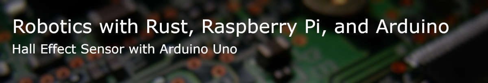
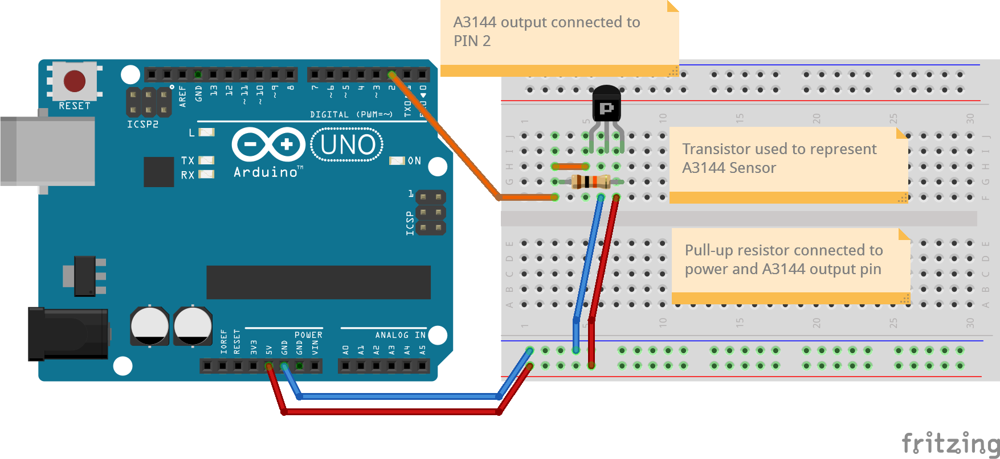
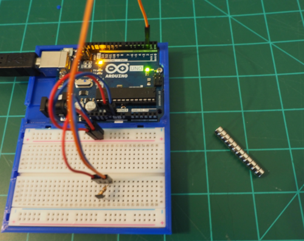
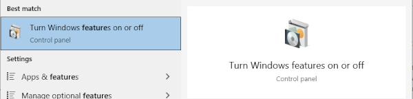
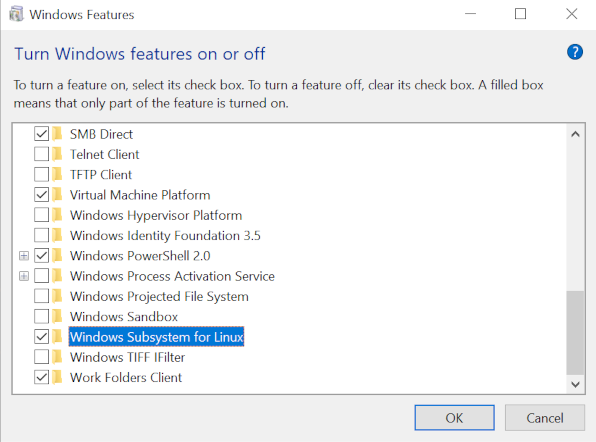

This project is a simple sensor example using embedded Rust, Arduino Uno R3, and a hall-effect sensor. This project takes advantage of the AVR HAL crate for Arduino support.

# Getting Started

## Parts List
* Arduino Uno R3
* A3144 Hall Effect Sensor
* 10k&#x3a9; Resistor
* Jumper wires
* Magnet

The assembled project

# Building 

We have tested the build and deployment of this application on 
* Windows 10
* Mac OSX 
* Ubuntu Linux 20.04

The setup instructions for Windows 10 are below with the Linux and Mac being added soon.

## Windows 
There are probably other ways to build Rust AVR projects on Windows 10 but this the pattern we currently use.

We switch back and forth between Windows Powershell and an Ubuntu WSL environment quite a bit. We prefer the [Windows Terminal](https://www.microsoft.com/store/productId/9N0DX20HK701) app in the Microsoft Store for this; however, it is not required.

### AVR Build in WSL
We build the Rust AVR application in the Windows Subsystem for Linux (WSL). To build the project on Windows 10, we recommend enabling WSL and installing Ubuntu 20.04 LTS release from the Microsoft Store. To enable WSL press the Windows key or click the start menu and type "Features". Select "Turn Windows Features on or off"

Enable WSL

Once you have successfully enabled WSL you should download the [Ubuntu 20.04 LTS](https://www.microsoft.com/store/productId/9N6SVWS3RX71) app from the Microsoft store.

### Additional Tools
In addition to the WSL tool chain we use the latest [Arduino IDE 2.0.0-Beta 5](https://www.arduino.cc/en/software) primarily as a serial port monitor; however, you will also need it to execute the avrdude command to flash the application to your Arduino.

We use [VS Code](https://code.visualstudio.com/Download) for Rust development; however, any editor with basic Rust support should be sufficient to modify the code.

## AVR Tool Chain and Rust
(Ubuntu Linux and Windows WSL Ubuntu Linux)

Open an Ubuntu bash shell in Windows Terminal or your Ubuntu desktop and install the AVR GCC tool chain. This will install all of the dependencies you will require for AVR development:

    # sudo apt install gcc-avr

You will want to get the Linux Rust environment set up once you have installed Ubuntu 20.04. 

You may get Rust by installing it from the official Rust Language site. 

    # curl --proto '=https' --tlsv1.2 -sSf https://sh.rustup.rs | sh

Once you have installed Rust you will want to install Rust nightly and rust-src with rustup.

    # rustup install nightly
    # rustup component add rust-src

__NOTE__ : Due to a regression in the LLVM stack you will currently need to use a version of Rust nightly at or before January 7, 2021. To do this install the nightly 2021-01-07 build:

    # rustup install nightly-2021-01-07   

## Mac OSX
Coming Soon

# Compiling

Once you have your envrionment set up and the project downloaded you are ready to build and install. 

For Windows 10; using Windows Terminal open an Ubuntu bash shell and in your project directory.

For Linux or OSX open a terminal window in the project directory.

Compile with the cargo command:

    cargo +nightly-2021-01-07 build --release

The +nightly-2021-01-07 instructs cargo to build with a specific nightly rust build. We will have to use the 2021-01-07 nightly until the LLVM regression issue is addressed.

You may want to set a local override if you are frequently compiling. Type the cargo override command in the project directory:

    cargo override set nightly-2021-01-07

You can build without specifying the +nightly-2021-01-07 option once you set the override. 

# Installing
Installing will be done with avrdude. Once the build is complete you execute the avrdude command to flash the application to the Arduino. __NOTE__ On Windows 10 you will need to open a PowerShell terminal in Windows Terminal; however, if you are on Linux or OSX you can use the same terminal window that you used to build. avrdude has a number of options and more information can be found in the [avrdude user manual](https://www.nongnu.org/avrdude/user-manual/avrdude_4.html). From the project directory you should execute the avrdude command: 

    avrdude -p m328p -P [PORT] -c arduino -Uflash:w:target/avr-atmega328p/release/avrs-hall-sensor.elf:e 

should flash the application to your Arduino. 

You may use the Arduino IDE or Windows device manager to identify the appropriate port in Windows.

In Mac OSX you can find the Arduino port either through the Arduino IDE through the terminal. Open a terminal window and type the following command to find the Arduino through the terminal:

    ls /dev/tty*

The Arduino port  will typically be either /dev/tty.usbmodem* or /dev/tty/usbserial* with the '*' representing the specific port.

On a Linux system you can find the Arduino port through the terminal with the following command:

    ls /dev/tty*

The arduino will typically appear as /dev/ttyUSB* or /dev/ttyACM* with * representing the specific port.

